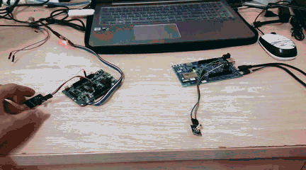
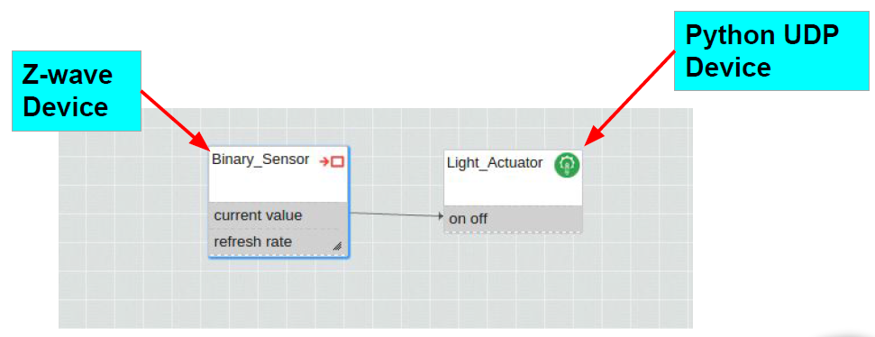

#Z-Wave Lab
##Outline
* [Objective](#objective)
* [Software](#software)
  * [Wuclasses for Z-wave Device](#wuclasses-for-z-wave-device)
  * [Light Actuator Code](#light-actuator-code)
* [Hardware](#hardware)
  * WuDevice
  * Z-Wave Dongle
* [Implementation](#implementation)

##Objective
 * The goal is to build an IoT network that communicate between <b>zwave device</b></font> and <b>udp device</b>.
 * The message between the devices in different gateway will be <b>transmitted by their gateways</b>.
 * Use two gateways with different radio let two devices with different radio can communicate with each other.

<br/>

###Wukong Topologic
<br/>

###Communicate Between Different Radio
<br/>

###WuDiagram
<br/>

##Software
###Wuclasses for Z-wave Device
Command : Create [**enabled_wuclasses.xml**](./enabled_wuclasses.xml) in wunode directory
```
cd <wkroot>/src/config/wunode
vim enabled_wuclasses.xml
```
[**enabled_wuclasses.xml**](./enabled_wuclasses.xml)<br/>
```xml
<WuKong>
    <WuClass name="Binary_Sensor" appCanCreateInstances="false">
        <CreateInstance />
    </WuClass>
</WuKong>
```
###Light Actuator Code
[**udpdevice_light_actuator.py**](./udpdevice_light_actuator.py)<br/>
Python Code (Only Important Part)
```python
if val == True:
if cnt % 2 == 0:
    digital_write(self.light_R, 0)
else:
    digital_write(self.light_R, 1)

if (cnt >> 1) % 2 == 0:
    digital_write(self.light_G, 0)
else:
    digital_write(self.light_G, 1)

if (cnt >> 2) % 2 == 0:
    digital_write(self.light_B, 0)
else:
    digital_write(self.light_B, 1)
if cnt < 7:
    cnt = cnt + 1
else:
    cnt = 0
```

##Hardware

###WuDevice


###Z-Wave Dongle

##Implementation

