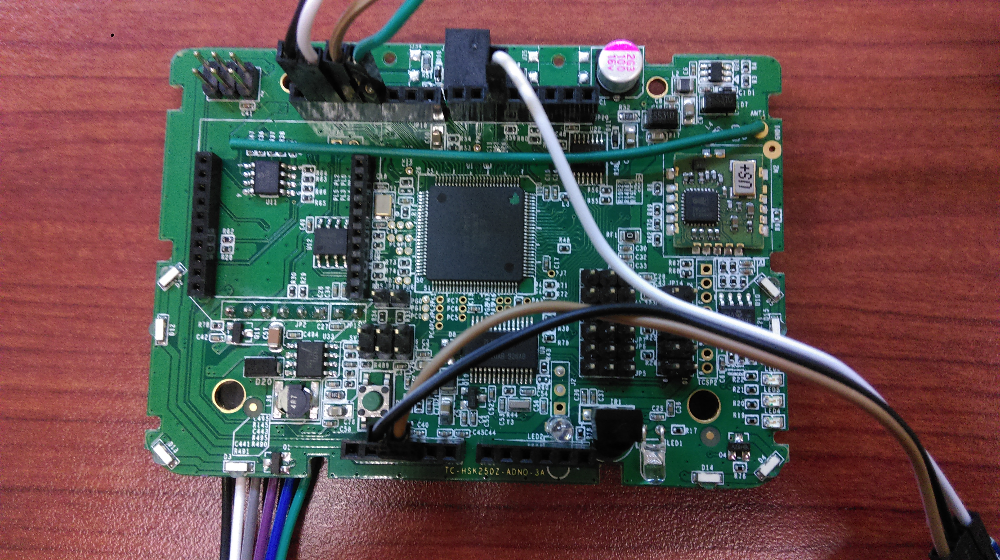

#Z-Wave Lab
##Outline
* [Objective](#objective)
* [Software Preparation](#software-preparation)
  * udpdevice_light_actuator.py
* [Hardware Preparation](#hardware-preparation)
  * WuDevice
  * Z-Wave Dongle
* [Implementation](#implementation)

Objective
--------------------
 
 The goal is to build an IoT network that connect between zwave device and udp device.
 Master is on PC.
 WuDevice gateway connect to PC by zwave.
 Edison gateay connect to PC by udp wifi.
 
Software Preparation
--------------------
###udpdevice_light_actuator.py

Hardware Preparation
--------------------
###WuDevice

###Z-Wave Dongle

Implementation
--------------------
